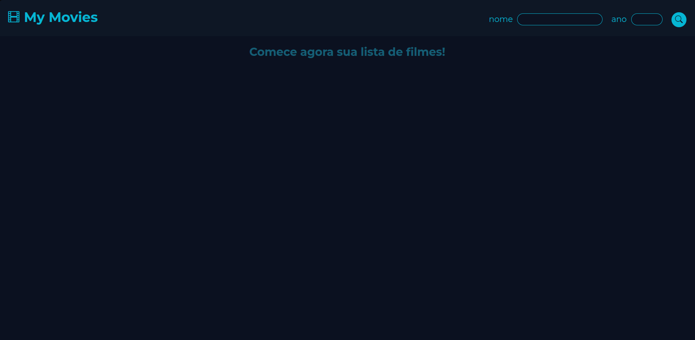
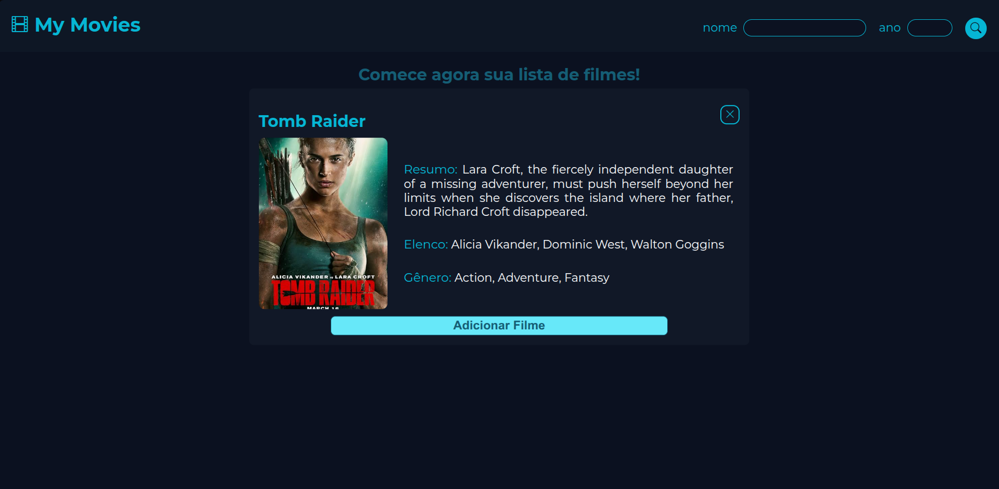
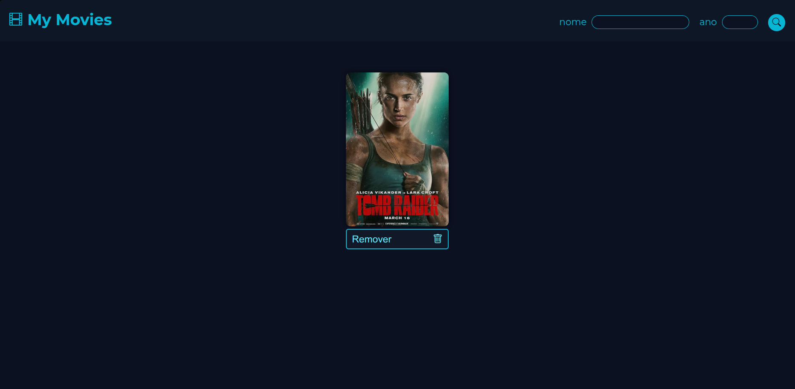

# 🎬 Gerenciador de Filmes

Aplicação web desenvolvida para pesquisar filmes utilizando a [OMDb API](https://www.omdbapi.com/), consultar informações como sinopse, elenco, gênero e pôster, além de criar uma lista pessoal de filmes diretamente no navegador.

O projeto foi criado para praticar consumo de API, manipulação do DOM, modularização com JavaScript e persistência de dados utilizando `localStorage`.

## 📸 Capturas de tela

### Tela inicial



### Detalhes do filme



### Lista de filmes



## ✨ Funcionalidades

- Pesquisa de filmes pelo título.
- Filtro opcional pelo ano de lançamento.
- Busca pelo botão de pesquisa ou pela tecla `Enter`.
- Exibição dos detalhes do filme em um modal.
- Visualização de título, pôster, sinopse, elenco e gênero.
- Adição de filmes a uma lista pessoal.
- Validação para impedir filmes duplicados.
- Remoção de filmes da lista.
- Persistência dos filmes no navegador utilizando `localStorage`.
- Mensagens de sucesso e erro utilizando Notie.
- Layout responsivo para diferentes tamanhos de tela.

## 🛠️ Tecnologias utilizadas

<p align="left">
  
  
  
  
  
  
  
  
</p>

## ⚙️ Como a aplicação funciona

1. O usuário informa o título do filme e, opcionalmente, o ano de lançamento.
2. A aplicação valida os valores informados.
3. Uma requisição é enviada para a OMDb API.
4. As informações recebidas são apresentadas em um modal.
5. O usuário pode adicionar o filme à sua lista pessoal.
6. A lista é salva no `localStorage`.
7. Ao recarregar a página, os filmes salvos são restaurados automaticamente.

## 📁 Estrutura do projeto

```text
Gerenciador-de-filmes/
├── assets/
│   ├── icons/
│   │   └── film_favicon.svg
│   └── screenshots/
│       ├── tela-inicial.png
│       ├── detalhes-filme-modal.png
│       └── lista-filmes-adicionados.png
├── data/
│   └── arquivo.json
├── scripts/
│   ├── entradas.js
│   ├── key_exemplo.js
│   ├── listaFilmes.js
│   ├── localStorage.js
│   └── modal.js
├── styles/
│   ├── media-1300.css
│   ├── media-920.css
│   ├── media-750.css
│   ├── media-560.css
│   ├── media-430.css
│   ├── modal.css
│   └── style.css
├── .gitignore
├── index.html
└── README.md
```

## 📄 Responsabilidade dos arquivos JavaScript

| Arquivo | Responsabilidade |
| --- | --- |
| `entradas.js` | Captura os campos, valida os valores e realiza a consulta à OMDb API. |
| `modal.js` | Preenche, abre e fecha o modal com os detalhes do filme. |
| `listaFilmes.js` | Cria a lista visual, adiciona filmes e processa as remoções. |
| `localStorage.js` | Salva, recupera e remove os filmes do armazenamento do navegador. |
| `key_exemplo.js` | Modelo de exemplo utilizado para criar o arquivo local que contém a chave da API. |

## ✅ Pré-requisitos

Para executar o projeto, é necessário ter:

- Um navegador moderno.
- O Git instalado.
- Uma chave válida da OMDb API.
- Um servidor local, como o Live Server ou o servidor HTTP do Python.

## 🔑 Configuração da chave da OMDb API

Por segurança, a chave da API não está disponível no repositório.

### 1. Obtenha uma chave

Acesse a página da [OMDb API](https://www.omdbapi.com/apikey.aspx) e solicite sua própria chave.

### 2. Crie o arquivo local da chave

Dentro da pasta `scripts`, copie o arquivo:

```text
key_exemplo.js
```

Renomeie a cópia para:

```text
key.js
```

Também é possível fazer isso pelo terminal.

No Windows PowerShell:

```powershell
Copy-Item scripts/key_exemplo.js scripts/key.js
```

No Linux ou macOS:

```bash
cp scripts/key_exemplo.js scripts/key.js
```

### 3. Adicione sua chave

Abra o arquivo:

```text
scripts/key.js
```

Substitua o valor de exemplo pela sua chave da OMDb API.

Não altere o nome da variável ou a estrutura do arquivo.

## 🚀 Executando localmente

Clone o repositório:

```bash
git clone https://github.com/brenda-dev001/Gerenciador-de-filmes.git
```

Entre na pasta do projeto:

```bash
cd Gerenciador-de-filmes
```

Configure o arquivo `scripts/key.js` seguindo as instruções da seção anterior.

Depois, inicie um servidor local.

Com Python:

```bash
python -m http.server 8000
```

Em algumas instalações, o comando pode ser:

```bash
python3 -m http.server 8000
```

Abra no navegador:

```text
http://localhost:8000
```

Também é possível executar o projeto utilizando a extensão **Live Server** do Visual Studio Code.

> O servidor local é necessário porque o projeto utiliza módulos JavaScript com `type="module"`.

## 🎮 Como usar

1. Digite o nome de um filme no campo **Nome**.
2. Opcionalmente, informe um ano com quatro dígitos.
3. Clique no botão de pesquisa ou pressione `Enter`.
4. Confira os detalhes exibidos no modal.
5. Clique em **Adicionar filme** para salvar o item na lista.
6. Utilize o botão **Remover** para excluir um filme.

## 💾 Persistência dos dados

Os filmes adicionados são armazenados no `localStorage`.

Isso significa que:

- A lista continua disponível após atualizar ou fechar a página.
- Os dados ficam salvos somente no navegador e no dispositivo atuais.
- A limpeza dos dados do navegador remove a lista.
- Não existe sincronização entre dispositivos diferentes.

## ✔️ Validações implementadas

- O nome do filme é obrigatório.
- O ano, quando informado, deve possuir quatro dígitos numéricos.
- Filmes não encontrados geram uma mensagem de erro.
- Um mesmo filme não pode ser adicionado mais de uma vez.
- Campos inválidos impedem o envio da pesquisa.

## 👩‍💻 Autoria

Desenvolvido por [Brenda](https://github.com/brenda-dev001).
